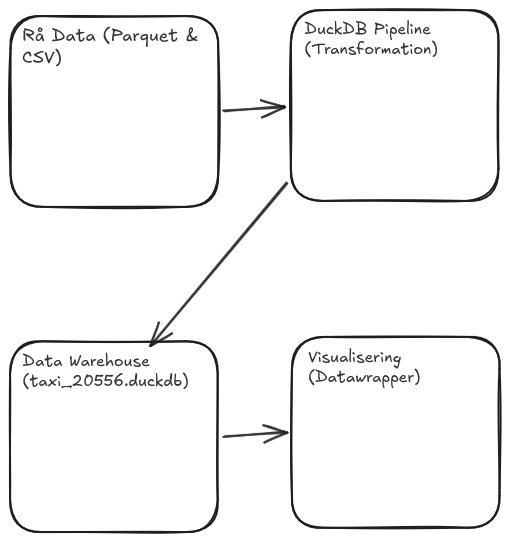

# Arkitektur

**Version 1.0 · Mathias Christiansen**

## Indhold

1. [Data](#data)
2. [Analysebehov](#analysebehov)
3. [Arkitekturskitse](#arkitekturskitse)

## Data

**Yellow Taxi:** En rå række ser ud til at repræsentere:

> En **enkelt fuldført taxatur** i New York City. Rækken registrerer en specifik historisk hændelse: hvornår og hvor turen startede og sluttede, hvor langt der blev kørt, antallet af passagerer, samt en fuldstændig økonomisk specificering af takster, afgifter og drikkepenge.


**Taxi Zone Lookup:** En række repræsenterer:

> En **geografisk zone** i New York, identificeret med et unikt `LocationID`, nu vi har vores PuLocationId og DoLocationId. Rækken oversætter id-nummeret til en specifik bydel (`Manhattan`), et specifikt områdenavn (`Alphabet Zity`) og en dertilhørende servicetype (`Yellow Zone`).

**Beskriv 3–5 relevante felter med egne ord. Find betydning og enheder i TLC's dataordbog, og henvis til kilden. Notér også en eventuel uventet værdi uden at ændre raw-data:**

> Kilde: *NYC Taxi & Limousine Commission (TLC) official Data Dictionary.*
> 
> *   **tpep_pickup_datetime (TIMESTAMP):** Dato og klokkeslæt for, hvornår taxameteret blev startet.
> *   **trip_distance (DOUBLE):** Turens officielle længde målt i *miles* af taxameteret.
> *   **PULocationID (INTEGER):** En numerisk id-kode, der refererer til den geografiske zone, hvor passageren blev samlet op.
> *   **payment_type (BIGINT):** En numerisk kode for betalingsmetoden (f.eks. 1 = Kreditkort, 2 = Kontant).
> *   **tip_amount (DOUBLE):** Drikkepengebeløb målt i USD. Registreres automatisk ved kreditkort, men står ofte som 0 ved kontant betaling.

## Analysebehov

1. **Myldretid og efterspørgsel:** Find døgnets travleste timer ved at tælle antal ture per time (`tpep_pickup_datetime`) for at optimere vognmændenes placering af ledige taxaer.
2. **Drikkepenge-adfærd efter betalingstype:** Sammenlign kreditkort (`payment_type` = 1) med kontanter (`payment_type` = 2) for at bevise, at digitale betalinger fører til højere registrerede drikkepenge (`tip_amount`).
3. **Geografisk efterspørgsel (Zone Lookup):** Taxadata med zonefilen (`PULocationID` = `LocationID`) for at identificere, hvilke specifikke bydele og zoner der genererer de længste ture og største indtægter.

## Arkitekturskitse



### Begrundelse af dataflow ud fra analysebehovene
*   **1. Pil fra Rå Data ➔ DuckDB Pipeline:** 
    Dette repræsenterer dataudtrækket. De rå inputfiler (`.parquet` og `.csv`) opbevares og bevares 100% uændrede i mappen `data/raw/`. Dette sikrer dataintegriteten, så vi altid kan genstarte eller genskabe vores data warehouse fra bunden, hvis noget fejler. DuckDB-pipelinen rækker ud og indlæser disse filer direkte for, at kunne arbejde på dem.
*   **2. Pil fra DuckDB Pipeline ➔ Data Warehouse:** 
    Dette repræsenterer transformationen og indlæsningen. Det er her, data bearbejdes for at imødekomme analysebehovene. SQL-scripts tager de rå data, filtrerer outliers, foretager det nødvendige `JOIN` med zone-filen og gemmer det strukturerede resultat som rigtige tabeller i `data/warehouse/taxi_20556.duckdb`.
*   **3. Pil fra Data Warehouse ➔ Visualisering:** 
    Dette er slutmålet for vores præsentation. Visualiseringsværktøjer (DBeaver). Værktøjerne kobler sig direkte på vores færdige, optimerede database for at hente de præcise, aggregerede tal.

### Rå vs. Afledte data
*   **Rå data:** De originale filer i `data/raw/` (Yellow Taxi og Zone Lookup). De forbliver statiske og uændrede.
*   **Afledte data:** Alt hvad der findes i databasen `taxi_20556.duckdb` samt de grafer, der genereres i Datawrapper. Disse data er transformeret, filtreret og grupperet ud fra de rå data. Afledt data er det vi sidder og lavet pt.


## Arkitekturlag: Raw → Modeled → Aggregate

Vores dataløsning er opdelt i tre tydelige lag for at adskille rå data, struktureret modellering og hurtige opsummeringer:

1. **Raw (Rå lag):** 
   - *Placering:* `data/raw/` (indeholder `yellow_tripdata_2025-01.parquet` og `taxi_zone_lookup.csv`).
   - *Egenskab:* Originalt, uændret og statisk.
2. **Modeled (Modelleret lag / Star Schema):** 
   - *Placering:* `data/warehouse/taxi_20556.duckdb` (`fact_trip`, `dim_zone`, `dim_date`).
   - *Egenskab:* Afledt data, hvor relationer, datatyper og stjernemodellen er implementeret med 100% dækning af rækkeantal.
3. **Aggregate (Aggregeret lag):** 
   - *Placering:* Samme DuckDB-database (f.eks. tabellen `agg_zone_daily`).
   - *Egenskab:* Sammenfattede data på et grovere *grain* (fx pr. zone og ugedag) for at optimere ydeevnen på hyppige analysemønstre.

## Datalivscyklus, Backup og Rebuild

*   **Rebuild vs. Backup:** Alt i *Modeled* og *Aggregate* lagene er afledt data. Hvis DuckDB-databasen bliver slettet, behøver vi ikke en traditionel databasebackup. Vi kan foretage en fuld **rebuild** ved at køre vores SQL-pipeline direkte mod de uændrede rå Parquet-filer i *Raw*-laget:

    
    # 1. Genskab dimensioner (dim_zone og dim_date)
    python src/run_sql_file.py sql/02_dimensions.sql

    # 2. Genskab fact-tabellen (fact_trip) ud fra rådata
    python src/run_sql_file.py sql/03_fact_trip.sql

    # 3. Genskab aggregat-tabellen (agg_zone_daily)
    python src/run_sql_file.py sql/04_aggregates.sql
    

*   **Kilde og versionering:** Vores SQL-filer og Python-scripts i Git fungerer som kodemæssig versionering, men **Git er ikke en databackup**. De rå data skal bevares separat.

## Valg af Data Store (DuckDB)

*   **Valgt teknologi:** DuckDB.
*   **Konkrete adgangsmønster:** kolonneorienteret lagring af store mængder historiske rækker (ca. 3,5 mio. rækker) lokalt på en maskine med komplekse joins og aggregeringer.
*   **Begrænsning:** DuckDB er begrænset (kun én process kan skrive til databasen ad gangen)
*   **Relevant alternativ:** PostgreSQL 

## Arkitektoniske Perspektiver

*   **Data Warehouse vs. Data Lake vs. Lakehouse:** Vores løsning er et mini-Lakehouse/Warehouse-setup, hvor vi udnytter effektiviteten fra rå kolonnefiler (Parquet).

### Den implementerede batch-pipeline

Tegn det dataflow, som `src/pipeline.py` faktisk kører. Vis konkrete input, SQL-trin, DuckDB-tabeller og afhængigheder. Markér tydeligt, hvad der er raw input, transformation og lagret resultat. Pilenes labels skal beskrive handlingen.

[Raw Input (CSV/Parquet)] 
       │ (Load)
       ▼
[DuckDB Warehouse: taxi_20556.duckdb] 
       │ (Transform via STEPS)
       ├── 1. dimensions (02_dimensions.sql) ──► dim_zone, dim_date
       ├── 2. fact_trip    (03_fact_trip.sql)    ──► fact_trip (medFKs)
       └── 3. aggregate    (04_aggregates.sql)   ──► Opsumerede tabeller/views


Forklar, hvorfor `01_explore.sql` ikke er et build-trin. Beskriv også, hvad pipelinen gør, hvis en påkrævet SQL-fil mangler, er tom eller fejler under kørsel, og hvornår resultaterne gøres gældende.


* Vores `01_explore.sql` er en sandkasse, bruges til at kører forespørgsler på rå-data
* Vores pipeline fejler, hvis en påkrevet sql-fil mangler. Den ville lave fange det i vores (except) og lave en ROLLBACK

### ETL eller ELT – angiv destinationen

Beskriv forløbet som ETL og/eller ELT. Navngiv det lager, du betragter som destination, og placér extract, load og transform i forhold til dette. Hvis betegnelsen ændrer sig, når destinationen ændres, skal du forklare hvorfor.

* Klassifikation: ELT (Extract, Load, Transform).
* Destination: Det lokale DuckDB-datavarehus (data/warehouse/taxi_20556.duckdb).
* Begrundelse: Vi henter rådata (Extract) og indlæser dem direkte i DuckDB (Load) uden forudgående komplekse transformationer. Først derefter udfører databaseengine'en selv transformationerne (Transform) via vores SQL

### Genkørsel og næste batch

Dokumentér resultatet af to kørsler med de samme raw-inputs. Brug relevante tællinger eller andre kontroller til at vise, om den anden kørsel fordoblede data. Skeln derefter mellem denne genkørsel og en plan for at modtage en ny måneds fil.

* Forventning: Vi forventer, at vores data ikke bliver fordoblet. Det gør vi fordi, at i vores sql-filer har vi sørget for at vi ikke laver en "INSERT INTO". Vi laver derfor en "CREATE OR REPLACE TABLE".
* Observeret: Når du tæller rækkerne i f.eks. fact_trip efter første kørsel og sammenligner med efter anden kørsel (f.eks. via SELECT COUNT(*) FROM fact_trip), er tallet fuldstændig det samme. Der er 0 nye rækker og 0 dubletter.
* Konklusion: Dette viser, at vores pipeline er sikker og kører.


> TODO: Plan for et nyt månedligt batch. Medtag filvalg, dataperiode, nøgler/overlap, schemaændringer, kontroller og beslutning om fuld rebuild eller inkrementel indlæsning. Planen skal ikke implementeres på Dag04.

### Streamingvariant og ansvar

* producer (NYC TLC stream) → queue eller log (f.eks. Kafka) → processor (streaming app) → data store (OLAP warehouse) → anvendelse (Grafana)

Angiv hvilken hændelsestid der er relevant, hvordan gentagelser eller forsinkede events kan påvirke resultatet, og hvilket ansvar der ligger hos henholdsvis producer, queue/log, processor og orchestrator. Forklar også hvorfor orchestratoren ikke udfører selve transformationen.


> TODO: Diagram og kort rolle-/fejlforklaring. Markér hele varianten som foreslået, ikke implementeret.

### Konceptuelt paralleliseringsdesign

Beskriv ét konkret scenarie, hvor parallel behandling kunne blive relevant. Et stort rækkeantal er ikke alene en begrundelse: angiv en udløser som målt køretid mod deadline, hukommelsesgrænse, I/O eller flere samtidige opgaver.

Tegn derefter:

```text
partitioner → workers → combine/merge → kontrolleret resultat
```

Vælg en partitioneringsnøgle, forklar hvordan delresultater kan kombineres, og beskriv mindst ét problem med overhead, skæv fordeling, rækkefølge eller dubletter. Skeln mellem parallelitet på én maskine og behandling på flere maskiner.

> TODO: Udløser, partitionering, workers, combine, kontrol og trade-off. Markér designet som foreslået.

### Implementeret, testet og foreslået

Afslut med en lille tabel:

| Element | Status | Evidens eller næste skridt |
| :--- | :--- | :--- |
| Lokal batch-pipeline | Implementeret og testet | `src/pipeline.py` kører fejlfrit med BEGIN/COMMIT/ROLLBACK |
| Genkørsel med samme input | Implementeret og testet | Verificeret mod tabeller; ingen duplikering af data |
| Nyt månedligt batch | Foreslået | Arkitekturklar, afventer næste måneds datasæt |
| Streamingvariant | Foreslået | Konceptuelt design beskrevet med Kafka/streaming |
| Parallel behandling | Foreslået | Designet med partitionering og multithreading-overvejelser |


